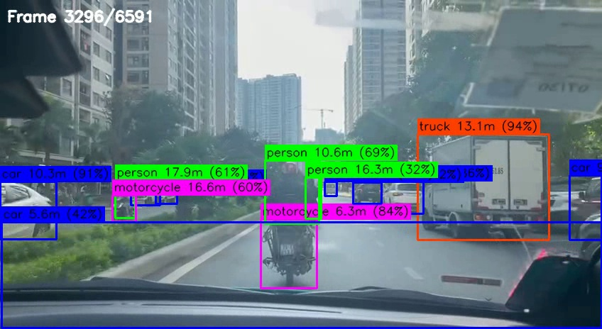
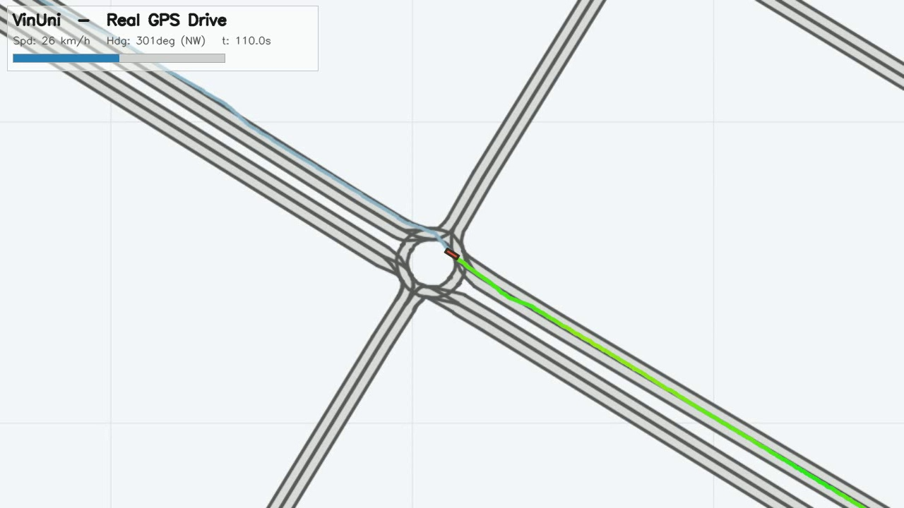
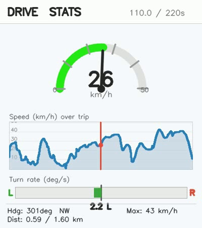

# Robotics Final Project — Driving Perception & Trajectory Visualization

[](https://www.python.org/)
[](https://github.com/ultralytics/ultralytics)
[](LICENSE)

A small, self-contained pipeline built around a single real-world drive in
Hanoi: ~220 s of first-person iPhone 12 dashcam footage paired with synchronized
IMU/GPS logs. From that one recording it produces:

1. **Obstacle detection + monocular distance** — YOLOv8 boxes road obstacles in
   the video and estimates how far away each one is.
2. **GPS trajectory on a real map** — the drive replayed on the VinUni / Ocean
   Park [CommonRoad](https://commonroad.in.tum.de/) lanelet network.
3. **A live driving-stats panel** — speedometer, speed-over-trip chart, and
   turn-rate, all derived from the GPS track.
4. **A standalone path visualization** (`path_viz/`) for side-by-side playback.

## Demo stills

| Obstacle detection | GPS drive on CommonRoad map | Drive-stats panel |
|:---:|:---:|:---:|
|  |  |  |

> The three views are timeline-synced and can be composited for side-by-side playback
> (see `docs/images/composite.jpg`).

## Repository layout

```
.
├── src/
│   ├── label_obstacles.py        # YOLOv8 detection + monocular distance → labeled mp4
│   ├── sample_frames.py          # dump verification stills at 10/30/50/70/90 %
│   ├── test_first_frames.py      # 5-second smoke test
│   ├── cr_gps_drive.py           # replay GPS track on the CommonRoad map → mp4
│   ├── stats_panel.py            # speedometer + charts panel → mp4
│   └── render_map_for_marking.py # high-res PNG of map + GPS for calibration
├── path_viz/                     # isolated GPS-path renderer (NumPy + OpenCV only)
│   ├── make_path_video.py
│   └── README.md
├── data/
│   ├── maps/                     # VinUni / Ocean Park CommonRoad scenarios (.xml)
│   ├── raw/sensors/              # iPhone Sensor Logger CSVs (+ SENSORS.md spec)
│   └── README.md
├── outputs/                      # rendered videos land here (git-ignored)
├── models/                       # YOLO weights (auto-downloaded, git-ignored)
├── requirements.txt
└── LICENSE
```

## Setup

```bash
git clone https://github.com/vthanhquang/robotics-final-project.git
cd robotics-final-project

python -m venv .venv
source .venv/bin/activate          # Windows: .venv\Scripts\activate
pip install -r requirements.txt
```

The raw dashcam clip and model weights are **not** committed (kept small by
`.gitignore`). YOLO weights download automatically on first run; place the
source footage at `data/raw/Car_OCP_3p_2605.MOV` — see
[`data/README.md`](data/README.md).

## Usage

All scripts are runnable from the project root and write to `outputs/`
(or `data/outputs/` for the detector).

```bash
# 1. Obstacle detection + distance overlay over the full video
python src/label_obstacles.py

# 2. Quick 5-second smoke test, then verification stills
python src/test_first_frames.py
python src/sample_frames.py

# 3. Replay the GPS drive on the CommonRoad map
python src/cr_gps_drive.py

# 4. Render the live driving-stats panel
python src/stats_panel.py

# 5. Standalone GPS-path video (no map dependency)
python path_viz/make_path_video.py
```

## How it works

**Detection & distance.** YOLOv8-L runs per frame over the COCO classes,
filtered to road obstacles (person, bicycle, car, motorcycle, bus, truck,
traffic light, stop sign, fire hydrant, dog, cat) at `conf ≥ 0.30`. Distance is
estimated monocularly from bounding-box height using known real-world object
heights:

```
distance_m = (real_height_m × focal_length_px) / bbox_height_px
```

with the iPhone wide-angle focal length approximated as `frame_height × 1.2`
(~73° FOV).

**GPS on the map.** `Location.csv` (~1 Hz) is projected WGS-84 → Web Mercator
(EPSG:3857), resampled to the video timeline with `np.interp` (bearing
interpolated on `(cos θ, sin θ)` to handle the 0/360° wrap), and drawn over the
CommonRoad lanelet network with a speed-coded trail, a heading-aligned car
marker, and a HUD.

**Stats panel.** A 400×450 overlay with a semicircular speedometer, a
speed-over-trip area chart with a playhead, and a left/right turn-rate bar
derived from the gradient of the unwrapped bearing.

See [`data/raw/sensors/SENSORS.md`](data/raw/sensors/SENSORS.md) for the full
sensor schema and conventions, and [`path_viz/README.md`](path_viz/README.md)
for the isolated path renderer.

## Trip summary

| Metric | Value |
|---|---|
| Duration | ~220 s |
| Distance | ~1.49 km |
| Peak speed | ~42.7 km/h |
| Region | Hanoi — Ocean Park (20.99° N, 105.94° E) |

## Known limitations

- Dashboard reflection is occasionally misdetected as a "car".
- No per-frame tracking, so the same object can flicker between frames.
- `mp4v`-encoded output is visually softer than the H.264 source.
- Monocular distance assumes upright, unoccluded objects of nominal height.

## License

Released under the [MIT License](LICENSE).
